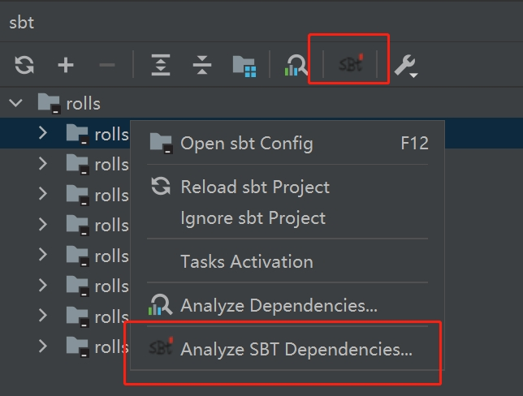
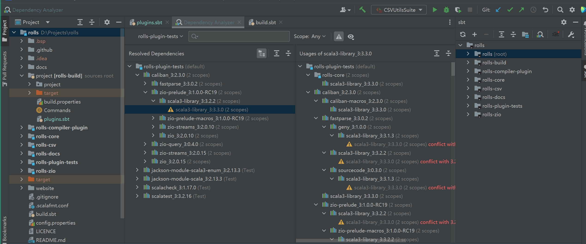
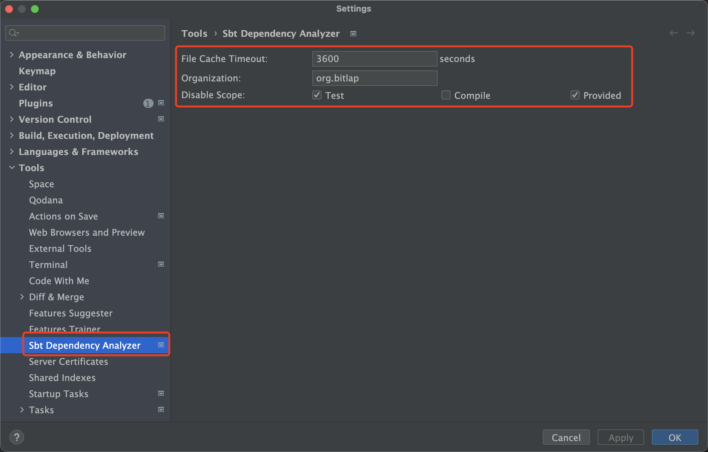
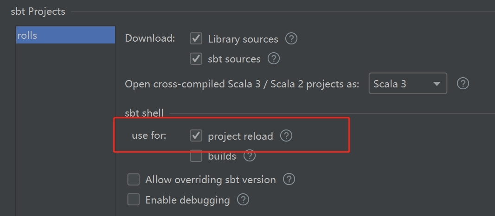

Sbt Dependency Analyzer for IntelliJ IDEA
---------


[](https://github.com/bitlap/intellij-sbt-dependency-analyzer/actions/workflows/ScalaCI.yml)
[](https://plugins.jetbrains.com/plugin/22427-sbt-dependency-analyzer/versions)
[](https://plugins.jetbrains.com/plugin/22427-sbt-dependency-analyzer)

中文 | [English](README.md)

## 特性

> 支持自 IntelliJ IDEA 2023.1 (231.9392.1) 起

- [x] 查看依赖树
- [x] 显示冲突
- [x] 搜索依赖
- [x] 定位依赖（多模块）
- [x] 显示模块间依赖关系
- [x] 查看 JAR 包大小

## 使用说明

此插件首次分析失败时将自动生成 `project/sdap.sbt` 文件，并在其中插入一行 `addDependencyTreePlugin` （或 `addSbtPlugin(...)` ）。 请勿修改或删除 `project/sdap.sbt` 文件。

此插件依赖于 `sbt-dependency-tree`，这是一个第三方插件，但现在已默认集成到 sbt 中（尽管默认情况下未启用，详见 [sbt 问题](https://github.com/sbt/sbt/pull/5880)）。

**让我们看看如何使用它！**

只需点击图标并等待分析完成：



分析完成后：



## 更多细节

该插件使用以下 sbt 任务。但请放心，插件已经优化，以尽量减少冗余执行：

1. `organization`
2. `moduleName`
3. `dependencyDot`
4. `reload`
5. `update`

## 高级设置

> 如果不确定，您可以安全地跳过这些配置！

通过使用配置，可以显著减少分析等待时间：



**文件缓存超时**

如果文件在超过 `3600` 秒内未更改，则插件将执行 `dependencyDot` 任务。否则，它将使用现有的文件，除非您选择进行 `刷新`。

**组织**

如果您指定了此值，则将不再使用 `organization` 任务获取项目的组织信息。

**禁用作用域**

如果不需要分析所有作用域，只需禁用您不想要分析的作用域。

配置是持久的，并与每个 IntelliJ 项目相关联。

与其他插件一样，此插件具有自己的存储位置，即 `.idea/bitlap.sbt.dependency.analyzer.xml`。删除此文件将清除缓存。

## 问题排查

### "Caused by: java.io.IOException: Could not create lock for ..."

由于插件需要使用 sbt shell，打开依赖分析视图并随后使用 IntelliJ IDEA 重新加载或构建项目可能会导致以下问题：

```
Caused by: java.io.IOException: Could not create lock for \\.\pipe\sbt-load5964714308503584069_lock, error 5
```

为避免此问题，使用 sbt shell 来重新加载或构建项目：



### 无法分析模块之间的依赖关系？

请确保您已应用了以下配置之一，以帮助识别正确的模块：

- 在 [高级设置](#高级设置) 中已配置 `organization`。
- 在 `build.sbt` 中使用 `ThisBuild` 或 `inThisBuild` 设置了 `organization` 值。


<br />

#### 如果你喜欢这个项目，或者对你有用，请[点击](https://github.com/bitlap/intellij-sbt-dependency-analyzer)右上角 ⭐️ Star 收藏吧~