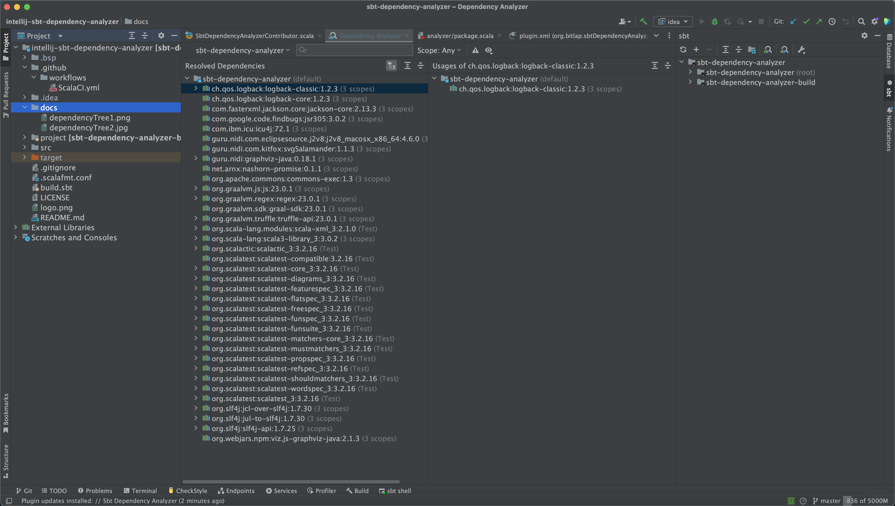
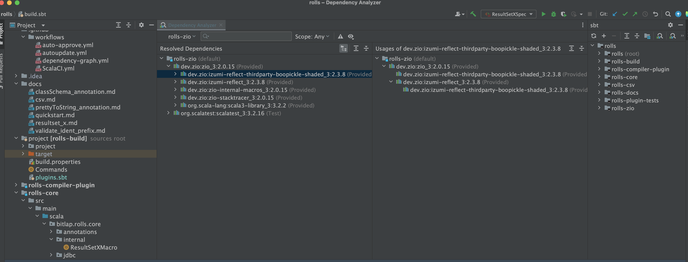

Sbt Dependency Analyzer for IntelliJ IDEA
---------

## Features

- Same features as the official Gradle Dependency Analyzer
  - View Dependency Tree
  - Show Conflicts
  - Search Dependencies
  - Location Dependency (multi-module)
- Support since Intellij IDEA 231 (231.9392.1)

**NOTE**: ***The plugin depends on `addDependencyTreePlugin` in `plugins.sbt` file.***

## How to start

If both the Gradle and SBT plugins are enabled in the environment, two analysis buttons will appear. Please try the latter one. (Generally speaking)

**Entry point one**

**Entry point two**

> The plugin currently has no depth limit, pay attention to memory.

## Preview

### Single Module

### Multiple Modules

### Show Conflicts

