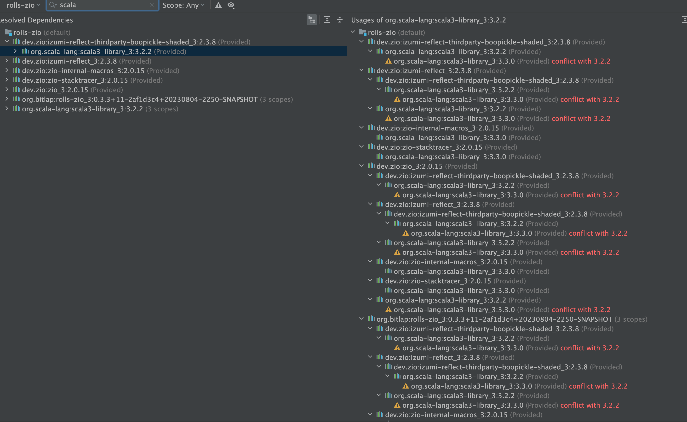
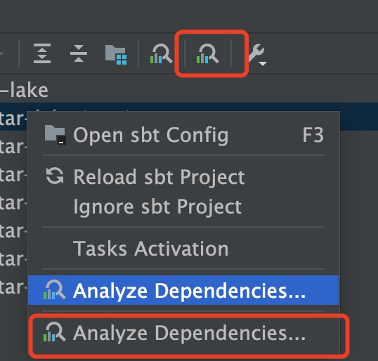

Sbt Dependency Analyzer for IntelliJ IDEA
---------

## Environment

- Java 11
- Scala 3.3.0
- Intellij 231.9392.1

## Features

- Same features as the official Gradle Dependency Analyzer

## Preview

### Conflict

### Note 

If both the Gradle and SBT plugins are enabled in the environment, two analysis buttons will appear. Please try the latter one. (Generally speaking)

> The plugin currently has no depth limit, pay attention to memory.
