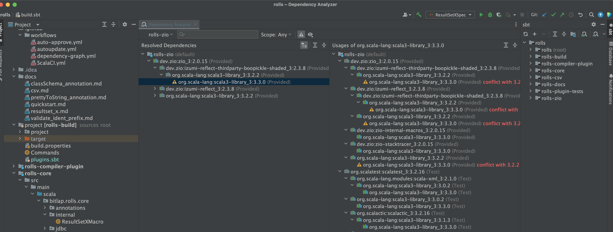

Sbt Dependency Analyzer for IntelliJ IDEA
---------

## Features

- Same features as the official Gradle Dependency Analyzer
  - View Dependency Tree
  - Show Conflicts
  - Search Dependencies
  - Location Dependency (multi-module)
  - Show dependencies between modules
- Support since Intellij IDEA 231 (231.9392.1)

**NOTE**: ***The plugin depends on `addDependencyTreePlugin` in `plugins.sbt` file.***

## How to start

To use this plugin, it is necessary to ensure that the following preparations are in place:

1. In the `project/plugins.sbt` file, there is a statement `addDependencyTreePlugin`. If not, please add it.
2. The plugin needs to execute `organization` to obtain the current module `organization`. 
   1. The plugin will take the last result of the `organization` command as the `groupId`. Therefore, the module must have set `organization`.
   2. For multi-module projects, if root module doesn't use `ThisBuild` or `inThisBuild` to set `organization`, then each module must be configured with `organization` in order to correctly analyze the dependencies between modules (such as: module A `dependsOn` module B). 
   3. To verify if `organization` is correctly configured, you can execute `module/organization` in the sbt shell. If not configured, the `organization` is a module name, which will not be able to analyze the modules that the current module depends on.

**NOTE:** **If both the Gradle and SBT plugins are enabled in the environment, two analysis buttons will appear. Please try the latter one. (Generally speaking, this is likely an issue with the Intellij IDEA or Intellij gradle plugin)**

**Entry point one**

**Entry point two**

### Show Conflicts

