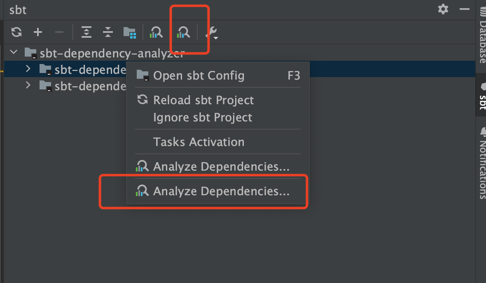
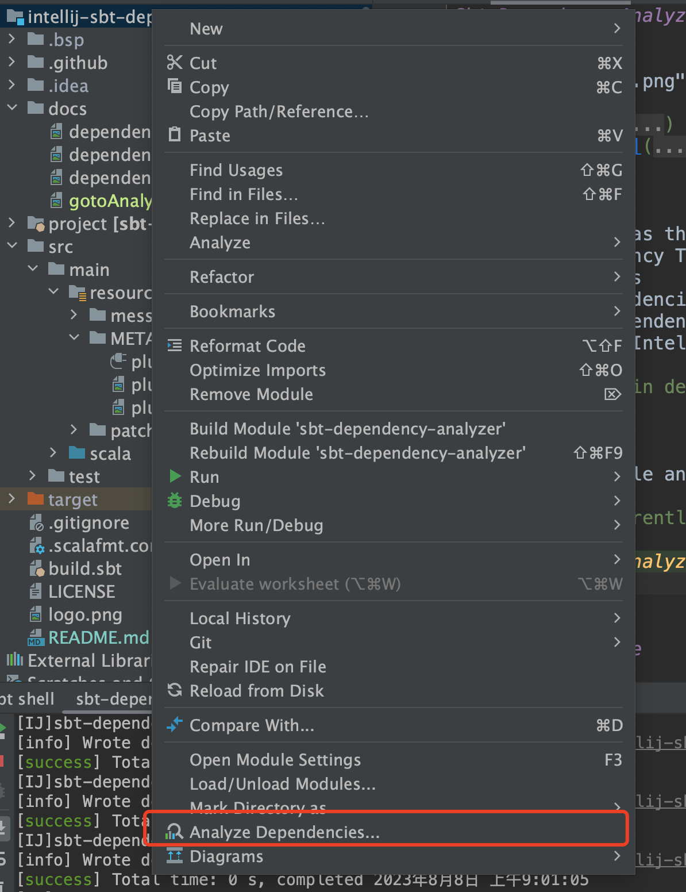
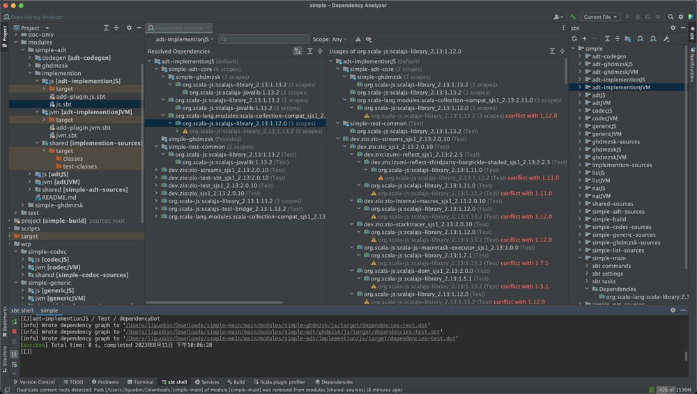

Sbt Dependency Analyzer for IntelliJ IDEA
---------

## Features

> Support since Intellij IDEA 2023.1 (231.9392.1)

- View Dependency Tree
- Show Conflicts
- Search Dependencies
- Location Dependency (multi-module)
- Show dependencies between modules

## How to start

To use this plugin, it is necessary to ensure that the following preparations are in place:
1. If the SBT version _**>=**_ 1.4, add one line of code `addDependencyTreePlugin` anywhere in the `project/plugins.sbt` file. If it already exists, please ignore it.
2. If the SBT version _**<**_ 1.4, there is no `addDependencyTreePlugin`. You need to manually add `addSbtPlugin("net.virtual-void" % "sbt-dependency-graph" % "0.10.0-RC1")`.

_**NOTE**_:
- Since Gradle is enabled by default in Intellij IDEA, this will appear two analysis buttons. Please try the latter one. (Generally speaking, this is likely an issue with the Intellij IDEA or Intellij Gradle plugin)

Entry point one 👈🏻

Entry point two 👈🏻

Show Conflicts 👈🏻

## For more details

_**The plugin will use these sbt commands**_:
1. `organization` get current project `organization`.
2. `moduleName` get all sbt modules.
3. `dependencyDot` get all dependency trees.

_**Why does it need to use these commands?**_
1. The plugin will take the last result of the `organization` command as the `groupId`. Therefore, the module must have set `organization`. 
2. For multi-module projects, if root module doesn't use `ThisBuild` or `inThisBuild` to set `organization`, then each module must be configured with `organization` in order to correctly analyze the dependencies between modules (such as: module A `dependsOn` module B). 
3. To verify if `organization` is correctly configured, you can execute `organization` in the sbt shell. If not configured, the `organization` is a module name, which will not be able to analyze the modules that the current module depends on. 
4. The plugin will take the sbt module name to check `artifactId` in dependency trees.  